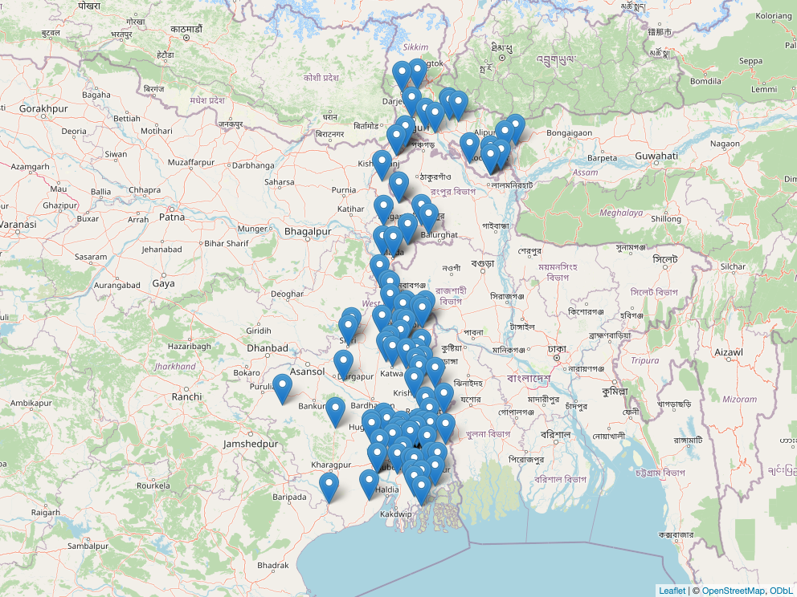
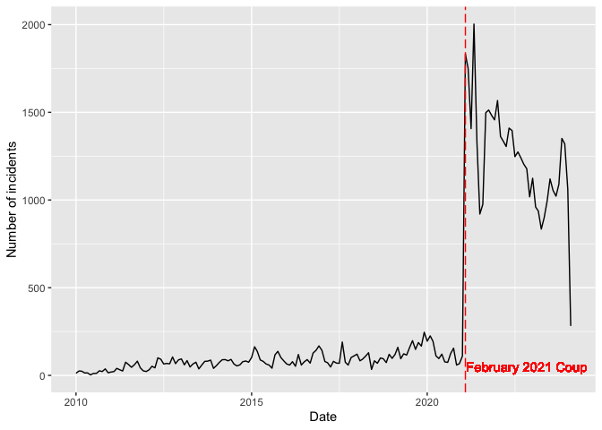

# PoliticalViolence
Autri Basu
2024-03-26

This file describes the PoliticalViolence package.

The package is interesting because it provides insight on an incredibly
comprehensive set of instances of political violence across the
continent of Asia, including how many deaths they caused, which types of
actors (i.e. rioters or government forces) were involved, and what type
of disorder occurred. It can be used for many analyses, such as when and
why political violence spikes, which regions it is most common in, and
which kinds of groups are most frequently involved in these incidents.

The PoliticalViolence package can be installed by running:

    devtools::install_github("STAT231-S24/PoliticalViolence")

``` r
library(PoliticalViolence)
glimpse(PoliticalViolence)
```

    Rows: 532,590
    Columns: 30
    $ event_id_cnty      <chr> "AFG67580", "AFG67582", "AFG67569", "AFG67579", "AF…
    $ event_date         <dttm> 2024-02-08, 2024-02-08, 2024-02-07, 2024-02-07, 20…
    $ year               <dbl> 2024, 2024, 2024, 2024, 2024, 2024, 2024, 2024, 202…
    $ time_precision     <dbl> 1, 1, 1, 1, 2, 2, 1, 1, 1, 1, 1, 2, 2, 1, 2, 1, 1, …
    $ disorder_type      <chr> "Political violence", "Demonstrations", "Political …
    $ event_type         <chr> "Riots", "Protests", "Violence against civilians", …
    $ sub_event_type     <chr> "Mob violence", "Peaceful protest", "Abduction/forc…
    $ actor1             <chr> "Rioters (Afghanistan)", "Protesters (Afghanistan)"…
    $ assoc_actor_1      <chr> "Shatori Communal Group (Afghanistan)", "Women (Afg…
    $ inter1             <dbl> 5, 6, 1, 2, 1, 1, 1, 8, 6, 1, 1, 1, 1, 2, 1, 1, 3, …
    $ actor2             <chr> "Rioters (Afghanistan)", NA, "Civilians (Afghanista…
    $ assoc_actor_2      <chr> "Shatori Communal Group (Afghanistan)", NA, "Former…
    $ inter2             <dbl> 5, 0, 7, 1, 7, 3, 7, 7, 0, 3, 7, 7, 7, 1, 3, 7, 7, …
    $ interaction        <dbl> 55, 60, 17, 12, 17, 13, 17, 78, 60, 13, 17, 17, 17,…
    $ civilian_targeting <lgl> FALSE, FALSE, TRUE, FALSE, TRUE, FALSE, TRUE, TRUE,…
    $ iso                <dbl> 4, 4, 4, 4, 4, 4, 4, 4, 4, 4, 4, 4, 4, 4, 4, 4, 4, …
    $ region             <chr> "Caucasus and Central Asia", "Caucasus and Central …
    $ country            <chr> "Afghanistan", "Afghanistan", "Afghanistan", "Afgha…
    $ admin1             <chr> "Ghazni", "Kabul", "Wardak", "Baghlan", "Paktia", "…
    $ admin2             <chr> "Andar", "Kabul", "Jalrez", "Pul-e-Hisar", "Samkani…
    $ location           <chr> "Shatori", "Kabul", "Jalrez", "Dashtak", "Samkani",…
    $ latitude           <dbl> 33.376, 34.517, 34.471, 35.658, 33.803, 34.517, 36.…
    $ longitude          <dbl> 68.409, 69.183, 68.654, 69.384, 69.817, 69.183, 66.…
    $ geo_precision      <dbl> 1, 3, 2, 1, 2, 3, 1, 1, 1, 2, 1, 1, 3, 1, 2, 1, 1, …
    $ source             <chr> "Hasht-e Subh; Shafaqna", "Rukhshana Media", "Hasht…
    $ source_scale       <chr> "National", "National", "New media-National", "New …
    $ notes              <chr> "On 8 February 2024, one person was killed after a …
    $ fatalities         <dbl> 1, 0, 0, 1, 1, 0, 1, 0, 0, 0, 0, 0, 0, 2, 1, 0, 1, …
    $ tags               <chr> "crowd size=no report", "crowd size=no report", NA,…
    $ crowd_size         <dbl> NA, NA, NA, NA, NA, NA, NA, NA, NA, NA, NA, NA, NA,…

# Sample analyses

## Map of incidents in West Bengal, India in July 2023 involving civilian targeting

This is an homage to the reason why I chose this dataset; it made me
think back to an issue of a Kolkata newspaper I saw when I was there
last summer. The front page featured a picture of some people fighting
one another at a polling station.

``` r
civilian_targeting_WB <- PoliticalViolence |>
  filter(
    civilian_targeting == TRUE,
    year(event_date) == 2023, 
    month(event_date) == 07, 
    admin1 == "West Bengal") |>
  select(event_id_cnty,event_type,location,latitude,longitude,fatalities)

map1 <- leaflet() |>
  addTiles() |>
  addMarkers(
    data = civilian_targeting_WB,
    popup = ~paste0("<b>",event_type,"</b></br>",location,"</br>",fatalities," death(s)")
  )
map1 |>
  mapshot2(file = "Bengal.png")

```


## Countries by number of deaths from political violence in 2023, excluding those with zero deaths

``` r
PoliticalViolence |>
  select(event_id_cnty,year,country,fatalities) |>
  filter(fatalities != 0, year == 2023) |>
  group_by(country) |>
  summarize(total_deaths = sum(fatalities)) |>
  arrange(desc(total_deaths)) |>
  rename("Country" = "country", "Deaths in 2023" = "total_deaths") |>
  knitr::kable()
```

<div class="cell-output-display">

| Country          | Deaths in 2023 |
|:-----------------|---------------:|
| Myanmar          |          15720 |
| Pakistan         |           2335 |
| India            |           1212 |
| Afghanistan      |           1128 |
| Philippines      |            851 |
| Papua New Guinea |            353 |
| Bangladesh       |            337 |
| Indonesia        |            185 |
| Thailand         |             57 |
| North Korea      |             12 |
| Vietnam          |             10 |
| China            |              9 |
| Nepal            |              9 |
| Sri Lanka        |              7 |
| Solomon Islands  |              1 |

</div>

## Number of incidents of political violence in Myanmar over time

``` r
PoliticalViolence |>
  filter(country == "Myanmar") |>
  # this wrangling is essentially grouping the dates by month by saying that every 
  # incident in month n occurred on the first day of that month, allowing for a 
  # more legible display than one that goes day-by-day
  mutate(
    Date = ymd(
      10000*year+100*month(event_date)+1
    )) |>
  group_by(Date) |>
  summarize(`Number of incidents` = n()) |>
  ggplot(aes(x = Date, y = `Number of incidents`)) +
  geom_text(x = ymd(20221101),y=50,label = "February 2021 Coup", color = "red") + 
  geom_line() + 
  geom_vline(xintercept = ymd(20210201), color = "red", linetype = "longdash") 
```


